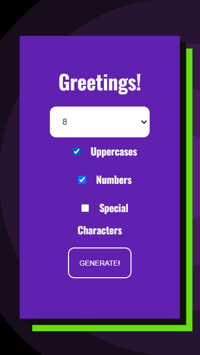
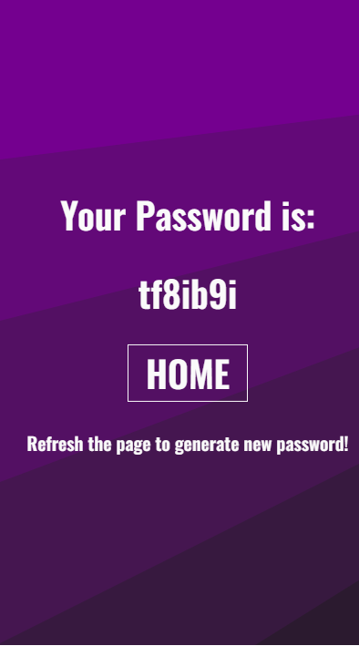

# **Django Random-Password Generator**

Random password Generator is a good starter project for beginners. The project is totally made up on basic Django and python stack.

## To run the code on your local machine follow these steps:
* Install **Python 3.0+**.
* Install Django using ```pip install Django```.
* Clone the project on your local machine.
* Now to run the server on your machine, just do '''py manage.py runserver'''.

## Screenshots:




